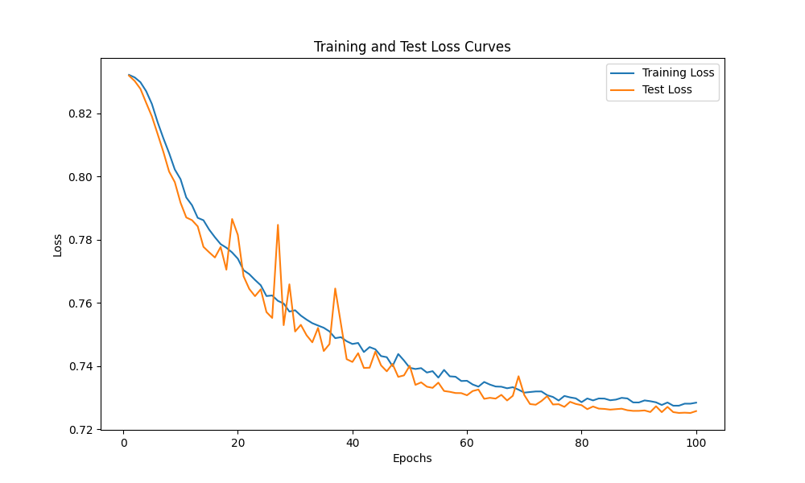

# HIV Inhibitor Molecule Classification using GNN
A Graph Neural Network with Graph Attention Layers paired with TopK pooling to classify and generate HIV inhibitor molecules

## Overview

## Data
The data for inhibitor molecules was obtained from [MoleculeNet](https://moleculenet.org/datasets-1) data repository. The file `HIV.scv` inclues experimentally measured abilities to inhibit HIV replication. This CSV includes three fields representing `molecule smiles` string, `activity` and `HIV_active` status. However the data is skewed in a way that there are 39684 samples for negative class (not HIV active) and 1443 samples for positive class (HIV active).

Following are some molecules visualized using RDKit Chem module.


*Visualization of random HIV negative molecules*


*Visualization of random HIV positive molecules*

These visualizations can be generated from the following code

```python 
from rdkit import Chem
from rdkit.Chem import Draw

# Convert SMILES to RDKit molecule object
molecules = [Chem.MolFromSmiles(smiles) for smiles in smiles]

# Draw the molecule into grid
img = Draw.MolsToGridImage(molecules, molsPerRow=3)
```

## Dataset Preprocessing

To handle class imbalance, the dataset was preprocessed before loading into a PyTorch Dataset class. Oversampling was used on the positive samples and increased them upto 10101 samples. Class imbalance will further be addressed by weighted loss during training.

The processed data was then seperated into two csv files using `sklearn.model_selection.train_test_split()` with a random split of 20:80. The csv files are stored in `data/train/raw` and `data/test/raw` seperately for proper working of the `torch_geometric.data.Dataset()` class. According to documentation, the Dataset class processes the data in the raw folder and caches in `root/processed` as a .pt file. 

To set up data for training run the `preprocess.py` file. The `dataset.py` file includes the class definition for the HIVDatset() object. Each molecule is saved as a PyTorch Geometric graph data object with node features, edge attributes, edge index and label. This is automated using DeepChem library [featurizers](https://deepchem.readthedocs.io/en/latest/api_reference/featurizers.html#molgraphconvfeaturizer). `MolGraphConvFeaturizer()` was used to extract different node level features using the SMILES string of a molecule. This requires RDKit to be installed. Some examples for features are Atom type, formal charge, hybridization, degree and chirality. The returned feature size is 30.

```python 
import deepchem as dc

# Initialize DeepChem featurizer
featurizer = dc.feat.MolGraphConvFeaturizer(use_edges=True)

# Generate features using DeepChem featurizers
out = featurizer.featurize(row["smiles"])

# Convert to PyG graph data
data = out[0].to_pyg_graph()
```

## Model
The model consists of 3 blocks of `conv.GATConv` Graph Attention Layers followed by two dense layers. 3 attention heads aer used in each block. TopK pooling (`pool.TopKPooling`) is used as pooling. The output from each block is concatenated and passed into the linear layers. This outputs a 2-vector. The implementation is found in the `model.py` file. The model takes feature size as input.

## Model Training
The training process is set up by first instantiating the train and test datset objects and dataloaders with `BATCH_SIZE = 128`. The model is initialized by passing `FEATURE_SIZE = 30` and send to the training device. The model has 17954818 trainable parameters. The following optimizer and loss combination is used for training. Class weights are used to handle class imbalance.

```python 
# Loss function and optimizer
weights = torch.tensor([1, 8], dtype=torch.float32).to(device)
loss_fn = torch.nn.CrossEntropyLoss(weight=weights)
optimizer = torch.optim.SGD(model.parameters(), lr=0.01, momentum=0.9)
scheduler = torch.optim.lr_scheduler.ExponentialLR(optimizer, gamma=0.95)
```

The `train_step()` and `test_step()` functions include the code for generating predictions, updating weights and calculating metrics during the training loop. Also exponential learning rate decay is used.


During training using Google Colab, `EPOCHS = 100` was used. 
> As of the current training iteration (2024 July 13) the model overfits the data and gives the following loss curves.



## Technologies used
- PyTorch Geometric
- RDKit
- DeepChem
- Google Colab

## References
- [PyTorch Geometric Graph Datasets](https://pytorch-geometric.readthedocs.io/en/latest/tutorial/create_dataset.html)
- [DeepChem Featurizers](https://deepchem.readthedocs.io/en/latest/api_reference/featurizers.html)
